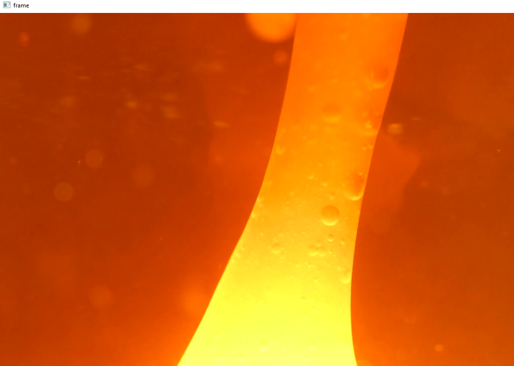
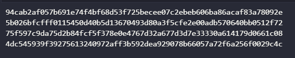

# Replica del muro de entropía

El muro de entropía es una pared con lámparas de lava que se ubica en la sede de Cloudflare en San Francisco. Estas lámparas generan datos capturados por una cámara, cada imagen única se convierte en una clave de cifrado aleatoria, esto es gracias al movimiento interno de las lámparas de lava, la cámara captura constantemente las variaciones y convierte cada imagen en una secuencia única de píxeles, que a su vez se convierte en una clave de cifrado impredecible, además cada pequeño cambio en la luz, la forma o el movimiento cambia los números utilizados para el cifrado, por lo que la empresa anima a las personas a visitar el muro, ya que cualquier cambio externo contribuye a que la aleatoriedad sea imposible de predecir.

Para generar estas claves usé videos, a partir de estos videos es como el algoritmo comienza a generar las claves, pero también se puede hacer uso de una cámara para generar los datos.

    
    

